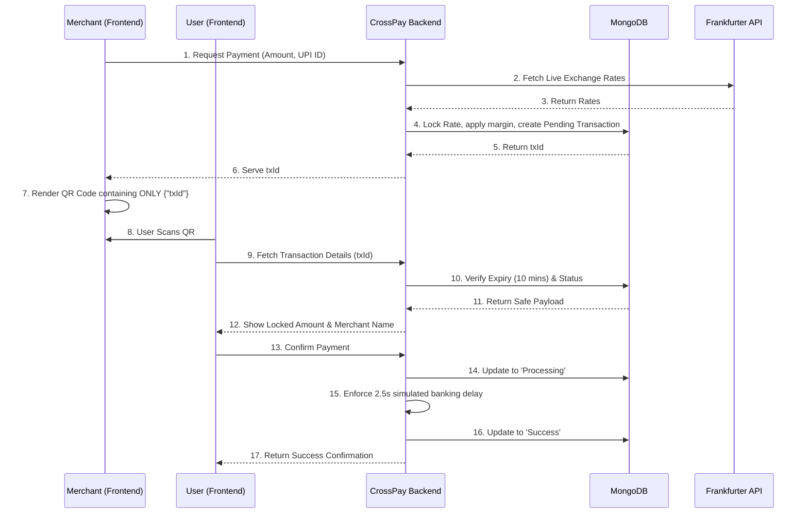

# CrossPay MVP

CrossPay is a next-generation cross-border payment application built to bridge the gap between international payers and local merchants. 

With CrossPay, an international user can pay using their local currency (USD, GBP, AED, etc.), and the local merchant will receive the funds seamlessly in their native currency (like INR) via UPI or direct bank payout—all driven by a locked, real-time exchange rate mechanism.

## Features

- **Dynamic IP-Based Currency Detection**: Automatically detects the payer's location and sets the base currency.
- **Universal UPI Cross-Currency Engine**: The backend automatically infers the required destination currency based on the merchant's UPI extension (e.g., `merchant.us` -> USD, `merchant@barclays` -> GBP, standard handles -> INR).
- **Real-Time FX Locking**: Fetches live exchange rates using the Frankfurter API, applies a platform margin, and guarantees a locked rate for the transaction.
- **Interactive QR Code Flow**: Generates secure QR codes containing only `txId` payloads to prevent tampering.
- **In-Browser Scanning**: Built-in HTML5 QR scanner allows users to simulate the complete dual-device checkout experience without needing native apps.
- **Merchant Dashboard**: Real-time polling dashboard to track pending, processing, and successful payouts.

## System Architecture & Trust Layer

CrossPay enforces a **zero-trust frontend architecture**. The frontend is purely a presentation and scanning layer; all financial logic, FX locking, and transaction state lifecycles are strictly enforced by the Node.js backend.



## Tech Stack

- **Frontend**: React, Vite, Tailwind CSS v4, Lucide React, HTML5-QRCode, QRCode.react
- **Backend**: Node.js, Express, MongoDB Atlas, Mongoose, Axios
- **External APIs**: Frankfurter (Live FX Rates)

## Getting Started

### Prerequisites
- Node.js (v18+)
- MongoDB Atlas Account (or local MongoDB)

### 1. Backend Setup

Open a terminal and navigate to the backend directory:

```bash
cd backend
npm install
```

Create a `.env` file in the `backend` directory and add your MongoDB connection string:
```env
PORT=5000
MONGODB_URI=mongodb+srv://<username>:<password>@<cluster>.mongodb.net/crosspay?appName=Crosspay
```

Start the backend server:
```bash
node server.js
```
*The server will start on `http://localhost:5000`.*

### 2. Frontend Setup

Open a second terminal and navigate to the frontend directory:

```bash
cd frontend
npm install
```

Start the Vite development server:
```bash
npm run dev
```
*The frontend will start on `http://localhost:5173`.*

## How to Run the Interactive Demo

CrossPay features a complete two-device interactive demo to showcase the cross-border QR flow.

1. **Open the Merchant Tab**: On your computer, open `http://localhost:5173/pay-international`.
2. **Generate a Request**: Ensure the **"Merchant (Create QR)"** tab is active. Enter a test Receiver Name and a UPI ID (e.g., `testmerchant@chase` for USD, or `testmerchant@ybl` for INR).
3. **Lock the Rate**: Enter the amount the merchant is requesting. The system will calculate the cross-currency estimate. Click **Generate Locked QR**.
4. **Scan to Pay**: Use your smartphone (connected to the same local network, using your computer's local IP address) to open the app, or simply open a second browser tab on your computer.
5. **Confirm**: Switch to the **"User (Scan & Pay)"** tab. Approve camera access and scan the generated QR code.
6. **Watch the Magic**: The scanner will fetch the locked transaction securely from the backend, display the total amount due in your local currency, and allow you to simulate a successful payment!
7. **View the Dashboard**: Navigate to `/dashboard` to see the transaction instantly update to **Success**.

## Deployment Notes

Before deploying the frontend to production (e.g., Vercel), ensure you replace all instances of `http://localhost:5000` in the frontend code (`PayInternational.jsx` and `Dashboard.jsx`) with your deployed backend URL (e.g., `https://crosspay-backend.onrender.com`).
